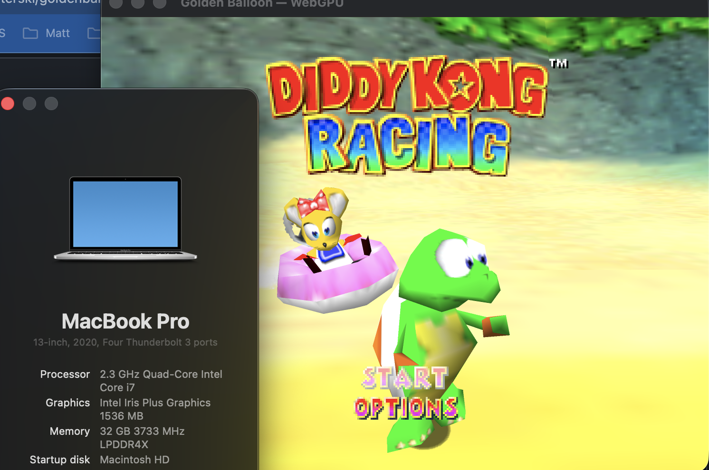

# goldenballoon-mactimber

macOS **Intel (x86_64)** build, bundle, and packaging scripts for
[akratch/goldenballoon](https://github.com/akratch/goldenballoon) — the native
source port of the 1997 N64 kart racer, built from its decompilation.
Upstream ships arm64, Windows, and Linux; this unofficial community wrapper
adds the missing Intel Mac build (macOS Sonoma 14+, validated on Tahoe).

Sibling ports:
[perfectdark-macvanta](https://github.com/mkoterski/perfectdark-macvanta),
[spaghettikart-maccheese](https://github.com/mkoterski/spaghettikart-maccheese),
[starship-macalfa](https://github.com/mkoterski/starship-macalfa).
Codename: *Timber* — the tiger who runs the races while Diddy's away.

> ⚠️ **You need a legally obtained Diddy Kong Racing N64 ROM to play** —
> US 1.1 or EU 1.1 (`.z64`/`.v64`/`.n64`), SHA-256-validated at runtime.
> No ROM or game data is ever bundled or needed to *build* —
> see [roms/README.md](roms/README.md).

---

## Status

**v1.0 — confirmed working on real Intel hardware (2026-09-04, tracks
goldenballoon v1.5.2).** Full pipeline validated: setup → build → bundle →
package → DMG install to `/Applications` → Gatekeeper flow → gameplay on
WebGPU. Next: upstream contribution — see [ROADMAP.md](ROADMAP.md).

## Confirmed Working (2026-09-04)



MacBook Pro 13" 2020 (i7-1068NG7, Intel Iris Plus, 32 GB), macOS Tahoe 26.5.2:

- **Build:** x86_64-only `mdkr64.app`, ad-hoc sealed, verify PASS, reports
  `mdkr64 1.5.2`. No patches needed (clang 21 OK).
- **Bundle:** rebranded to `com.mkoterski.goldenballoon-mactimber`, re-sealed;
  Gatekeeper + asset-free verifiers all PASS (6/6 checks).
- **Package:** `Golden-Balloon-MacTimber-1.5.2-Intel-Mac.dmg` (10 MB) +
  `.sha256`; DMG checksum and packaged-app re-verification PASS.
- **Install:** DMG → `/Applications`, launched via the documented Gatekeeper
  "Open Anyway" flow — no "damaged" error.
- **Gameplay:** US 1.1 ROM SHA-256-validated and loaded; **WebGPU
  (wgpu-native → Metal) works on Intel Iris Plus** — the main v1.0 unknown,
  answered. 1280×960 @ 2× render scale, 60 Hz fifo, clean exit (status 0).
  Minor: 4 audio underruns over a ~2.5 min session.

## Why is the app called `mdkr64.app`?

By design — that is not a bug. `mdkr64` is **upstream's engine name**: its
CMake target, binary, `CFBundleExecutable`, and `--version` string
(`mdkr64 1.5.2`). Upstream's `build_app_bundle.sh` assembles `mdkr64.app`,
and both upstream's verifiers and this wrapper's checks expect that name, so
the wrapper keeps it. Branding lives elsewhere: the bundle ID
(`com.mkoterski.goldenballoon-mactimber`, set by `gbmt-bundle-macos.sh`) and
the DMG name (`Golden-Balloon-MacTimber-<ver>-Intel-Mac.dmg`). `gbmt` is only
the script prefix, never the app name.

---

## How this differs from the sibling ports

Upstream ships a complete first-party macOS packaging pipeline
(`macos/Scripts/`: pinned SDL2 build, app bundling with ad-hoc signing, DMG
creation, asset-free verification). These scripts **wrap that pipeline with
`--arch x86_64`** instead of reimplementing it. The wrapper owns: the version
pin (upstream `v1.5.2`, bumped deliberately), series logging/UX, bundle
rebranding, x86_64-only enforcement (any arm64/universal output fails the
build), and run/diagnostics tooling.

---

## Requirements

- Intel Mac (x86_64) on macOS 14+ — validated: MacBook Pro 13" 2020
  (i7-1068NG7, Iris Plus), macOS Tahoe 26.5
- Xcode Command Line Tools (`xcode-select --install`)
- Homebrew with `cmake`, `pkg-config`, `python3`, `git` (installed
  automatically; Intel macOS is Homebrew **Tier 3** since 2026-09 — installs
  may compile from source)
- **Network access during build** (SHA-256-pinned wgpu-native fetch at
  configure time)
- ~5 GB free disk space

---

## Quick Start

```
git clone https://github.com/mkoterski/goldenballoon-mactimber.git
cd goldenballoon-mactimber
chmod +x *.sh
./gbmt-initial-setup.sh    # 1. toolchain check + clone upstream @ v1.5.2
./gbmt-build-macos.sh      # 2. SDL2 (x86_64) + engine + ad-hoc-signed .app
./gbmt-bundle-macos.sh     # 3. rebrand + re-seal + verify (x86_64, ROM-free)
./gbmt-package-macos.sh    # 4. distributable DMG + SHA-256 sidecar
./run-gbmt-macos.sh        # 5. play (put your ROM in roms/ first)
```

## Scripts

| Script | Purpose |
| --- | --- |
| `gbmt-initial-setup.sh` | One-time host check (CLT, Homebrew, tools) + pinned upstream clone |
| `gbmt-build-macos.sh` | Build pinned SDL2 + engine, assemble `mdkr64.app` via upstream, x86_64-only enforced. Flags: `--clean`, `--verbose` |
| `gbmt-bundle-macos.sh` | Rebrand bundle ID, ad-hoc re-seal, run upstream's Gatekeeper + asset-free verifiers with `--expected-arch x86_64` |
| `gbmt-package-macos.sh` | DMG via upstream `create_dmg.sh` → `dist/Golden-Balloon-MacTimber-<ver>-Intel-Mac.dmg` + `.sha256` |
| `run-gbmt-macos.sh` | Dev launcher; auto-passes a ROM from `roms/`; `--gl` forces the diagnostic OpenGL renderer |
| `gbmt-systeminfo.sh` | Host/GPU/toolchain snapshot for bug reports |
| `gbmt-collect-crash.sh` | Zip DiagnosticReports + logs for a bug report (never ROMs) |

---

## Renderer notes (Intel GPUs)

The qualified visual path is **WebGPU** (wgpu-native → Metal) — confirmed
working on Intel Iris Plus (2026-09-04). `./run-gbmt-macos.sh --gl` forces
the OpenGL backend — **diagnostic-only**, not for play.

## Gatekeeper ("unidentified developer")

Releases are ad-hoc signed (integrity seal, no Developer ID/notarization).
On first launch:

1. Attempt the launch once (double-click, let it refuse).
2. **System Settings → Privacy & Security** → **Open Anyway** → **Open**.

A **"damaged"** error is not normal — the seal is broken; re-run
`./gbmt-bundle-macos.sh` and file an issue. (Series lesson: on Tahoe,
`xattr -cr` alone is not sufficient — the ad-hoc seal is required.)

---

## Versioning

**v1.0 reached 2026-09-04** — confirmed end-to-end on the validated Intel Mac
(see Confirmed Working and [CHANGELOG.md](CHANGELOG.md)). From here versions
track the upstream pin, e.g. `v1.1 (tracks goldenballoon v1.6.0)` — see
[ROADMAP.md](ROADMAP.md).

## CI

`.github/workflows/build.yml` builds and packages on `macos-15-intel`
(available until ~Fall 2027). CI validates toolchain, binary arch, bundle
seal, and `--version` startup — not real GPU gameplay. Hardware testing
gates v1.0.

## Credits

- [akratch/goldenballoon](https://github.com/akratch/goldenballoon) — the
  Golden Balloon port and its macOS packaging pipeline (MIT)
- The Diddy Kong Racing decompilation contributors
- Sibling conventions: perfectdark-macvanta / spaghettikart-maccheese /
  starship-macalfa
- Intel Mac packaging scripts: mkoterski

Unaffiliated with Nintendo or Rare. No game assets included; bring your own
legally obtained ROM.
